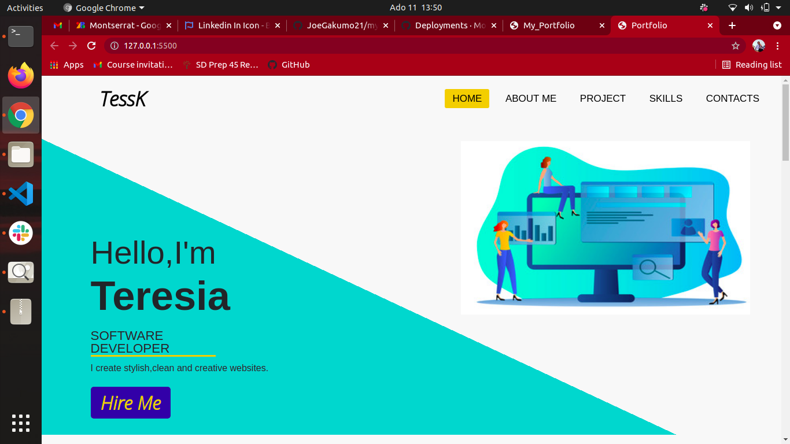
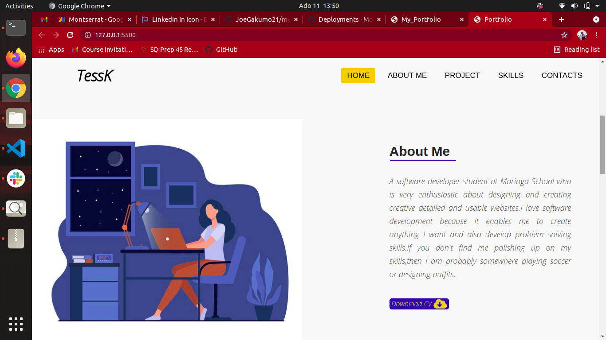
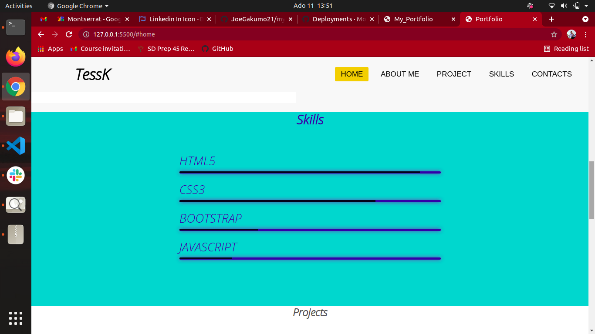
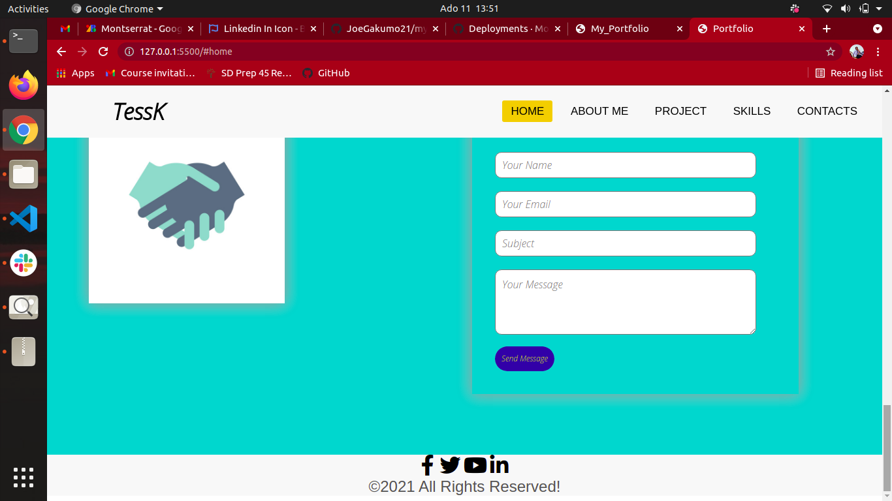

# PORTFOLIO LANDING PAGE
## The project was done by Teresia King'ori
### The portfolio project is a brief description of myself. It contains a logo to describe the brand . It also has a home page and an about me page describing my education background.There is also a skillset section describing the technologies i'm good at.The last section is the contact section and it has a form and my social handles.
___
## The Technologies Used are;
* HTML
* css
* BOOTSTRAP
___
### Installation Requirements
* Web Browser
* Git
* Github
___
## Link
### <a href="https://teresia012.github.io/portfolio_project/"> ACTIVE SITE</a>
___
## Screenshots
 
 
 
 

## LICENCE

## &COPY;2021 ALL RIGHTS RESERVED.

 
